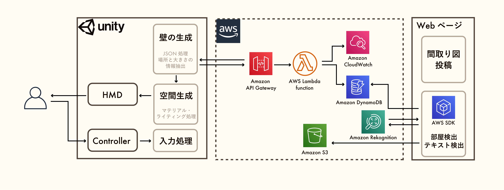

# At Home \~間取り図からVR内覧\~

## 製品概要

At Homeは、ウェブページに間取り図をアップロードするだけでVR内覧が手軽にできるアプリケーションです。

開発には主にDjango・AWS・Unityを使っています。

### 背景(製品開発のきっかけ、課題等）

家を探す時、ホテルに泊まる時など、部屋の空間情報が欲しい時は誰にでもあります。

ウェブサイトなどで情報を探すと、間取り図や部屋の一部の写真などが出てきますが、全体の構造だったり、広さの感覚だったり、行ってみないと分からないことはたくさんあります。

そのような空間的な「感覚」を手軽に試す方法はないかと考えて、この製品の開発を始めました。

### 製品説明（具体的な製品の説明）
### 特長

####　1. 手軽にVR内覧ができること

間取り図をウェブページにアップロードするだけで、VRアプリを立ち上げて間取り図のファイル名を選ぶとすぐ部屋の空間の中に入ることができます。

####　2. 家具を試し置きできること

VR空間内では椅子やテーブルなどの家具を置いて、その部屋をどのように使うのかをシミュレーションすることができます。
これにより、その家での実際の生活をより詳細に描くことができるようになります。

####　3. 家を建てる前にシミュレーションできる

この製品の用途は家探しに留まりません。間取り図を書いて新築のデザインを考えている方のサポートもできます。
新築は実際の家がないので写真もなく、間取り図からイメージを膨らませるしかないのですが、このサービスを使えば自動で部屋をシミュレーションできます。
実際に家に入った感覚で歩き回ることでより家を理想に近づけ、建てた後に後悔することが少なくなります。

### 解決出来ること

家探しあるあるの、

- イメージが湧きにくい
- 実際に行って初めて得られる空間的情報が多い
- VR内覧を用意してある物件・サイトは少ない

といった課題を解決することができます。

### 今後の展望

今後は、

- 機械学習を用いた文字認識精度の向上
- 機械学習を用いた物体検出精度の向上・検出する種類を増やす
- より充実したUI

などの機能を加えることを考えています。

## 開発技術

### 活用した技術

WebにはDjangoを使い、AWS　SDKの中でS3へのアップロード、DynamoDBへのデータの追加、Rekognitionを使ったテキスト検出を行っています。
また、データの受け渡しにはAWSサービスを利用し、UnityにはAPIの形でデータの提供をしています。
Unityでは受け取った値を処理し、描画をしています。さらにその中で自由に歩き回り、家具を置くなどの機能を実装してあります。

### 独自技術
#### ハッカソンで開発した独自機能・技術
* 間取り図からのデータの抽出について、部屋の輪郭とテキスト検出の情報を組み合わせて、部屋の実際の大きさを計算しました。(Django/jphacks2021/file_upload/contour_detection.py)

